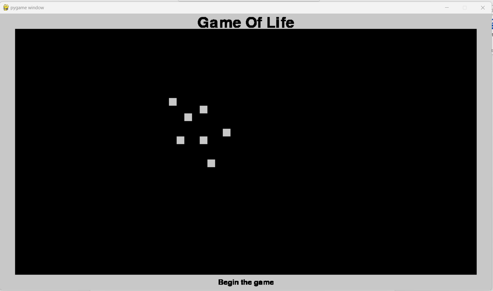
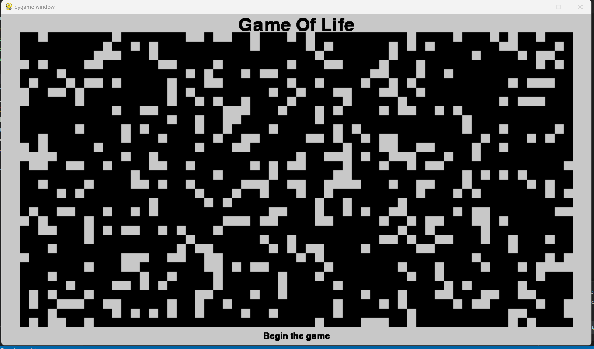
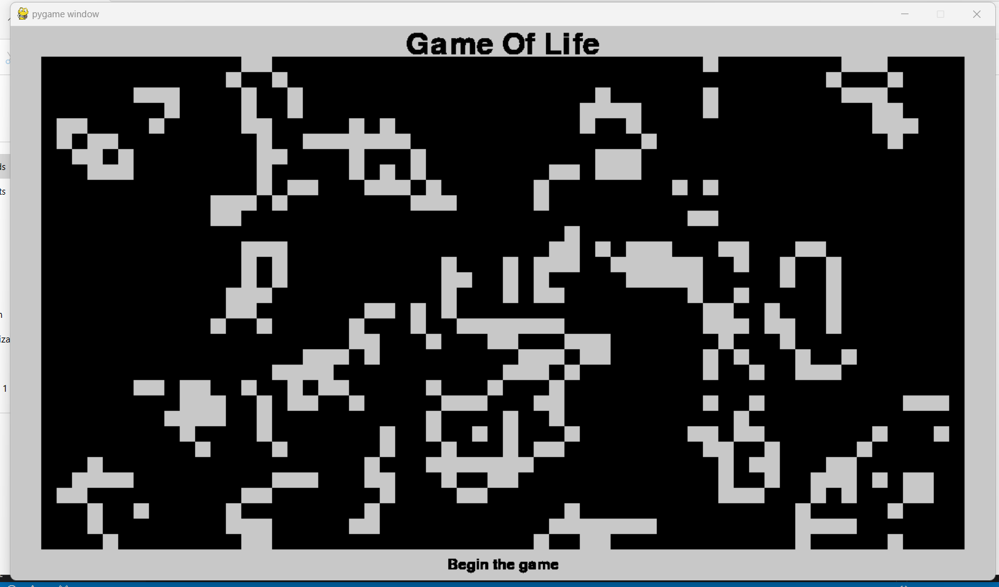
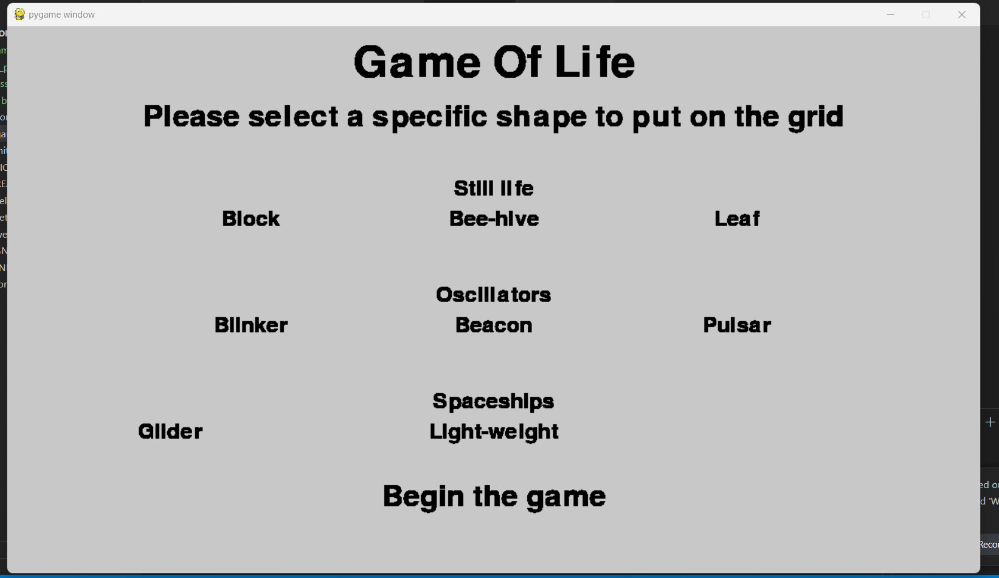

# GameOfLife-GINDRELouis-CDOF2
The famous game by mathematician John Horton Conway (Workshop 1 - Decentralization S8)

# Game of Life Project

This project has been made in the Decentralization Technologies class in order to complete the Workshop 1.
This project illustrates the famous game by mathematician John Horton Conway, which is "Game of Life". It is a cellular automaton and zero player game, meaning that its evolution is determined by its initial state, requiring no further input. 
Our project creates an initial configuration, with alive and dead cells, and we can observe how it evolves. It also allows us to check on different initial configurations and observe behaviors based on characteristics. 


These are the rules you can find on the wikipedia page of this game : 
The universe of the Game of Life is an infinite, two-dimensional orthogonal grid of square cells, each of which is in one of two possible states, live or dead (or populated and unpopulated, respectively). Every cell interacts with its eight neighbours, which are the cells that are horizontally, vertically, or diagonally adjacent. At each step in time, the following transitions occur:

Any live cell with fewer than two live neighbours dies, as if by underpopulation.
Any live cell with two or three live neighbours lives on to the next generation.
Any live cell with more than three live neighbours dies, as if by overpopulation.
Any dead cell with exactly three live neighbours becomes a live cell, as if by reproduction.

## Getting Started

These instructions will get you a copy of the project up and running on your local machine for development and testing purposes. See deployment for notes on how to deploy the project on a live system.

### Prerequisites

To run this project, ensure you have the following installed on your system

- Python 3.7 or higher.
- Pygame library is mandatory to display the graphical interface of the project. You can install it using pip:
```
pip install pygame
```
- If you want to clone this repository, you need to have git installed 


### Installing

A step by step series of examples that tell you how to get a development env running

- You first need to clone this repository using this in your project terminal :
```
git clone https://github.com/lgitdev/GameOfLife-GINDRELouis-CDOF2
cd GameOfLife-GINDRELouis-CDOF2
```
- Run directly the project
```
python game.py
```

It should display the following : 


## Different functionalities

Based on the image above,you have a small description of the game in order to understand how to play. You can click on the different texts to select the initialization technique. You then need to click on begin the game to display the grid. Once the grid has been displayed, you need to click again on "begin the game" to start the simulation. You can close it every time you want by closing the window : 
- Manually : you will need to click on the grid to put cells alive (white), and click back on it if you wan't this cell to be dead (black). By default, all cells are dead.
It should display the following : 


- Randomly : the program will automatically decide if the cell is alive (with a 20% probability) or dead. When clicking on "begin the game", it will start the simulation with this random initialization.


During the simulation, the screen changes thanks to the game of life rules :


- Using specific forms : as explained on the wikipedia page, you have specific forms that have different behaviors so we can study different approaches. Here is what you should see if you click on the select specific form option :


The still forms don't move once the simulation begin. The oscillators will change its form and come back to the original point at each point, as displayed below with the pulsar. The spaceships will move from one point to another. 


## Contributing

When contributing to this repository, please first discuss the change you wish to make via issue, email, or any other method with the owners of this repository before making a change.

Please note we have a code of conduct, please follow it in all your interactions with the project.

### Pull Request Process
1. Ensure any install or build dependencies are removed before the end of the layer when doing a build.
2. Update the README.md with details of changes to the interface.
3. Increase the version numbers in any examples files and the README.md to the new version that this Pull Request would represent.

### Code of Conduct
#### Our Pledge
In the interest of fostering an open and welcoming environment, we as contributors and maintainers pledge to making participation in our project and our community a harassment-free experience for everyone, regardless of age, body size, disability, ethnicity, gender identity and expression, level of experience, nationality, personal appearance, race, religion, or sexual identity and orientation.

## Versioning

Version 1.1

## Authors

* **GINDRE Louis**
  
See also the list of [contributors](https://github.com/lgitdev/GameOfLife-GINDRELouis-CDOF2/graphs/contributors) who participated in this project.

## License

This project is licensed under the MIT License - see the [LICENSE.md](LICENSE) file for details

